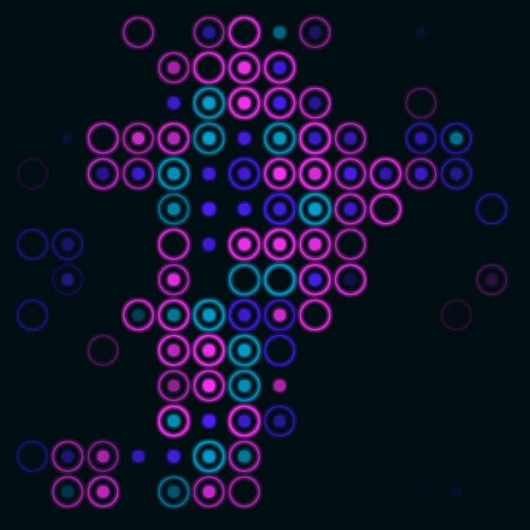
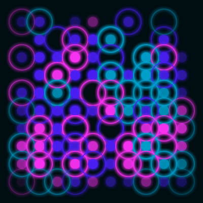

# Wallgen

A random wallpaper generator in go.

```console```
Usage of wallgen:
  -backround string
    	The background color (default "#000e12")
  -cells int
    	The cell distribution on the grid (0-100) (default 40)
  -inner int
    	The inner circle distribution on a cell (0-100) (default 80)
  -outer int
    	The outer circle distribution on a cell (0-100) (default 60)
  -output string
    	The output file (default "output.png")
  -palette string
    	The palette passed as sorted weighed colors (default "#fa32f3:100,#00a1cd:100,#4b1ff7:30")
  -step int
    	The step between each cells (default 60)
  -x int
    	The the x size of the image (default 800)
  -y int
    	The the y size of the image (default 800)


Example of generation:

Generated with size of 900x900
[ ]

Generated with cell distribution set to 80, step to 35 and size 400x400
[ ]

